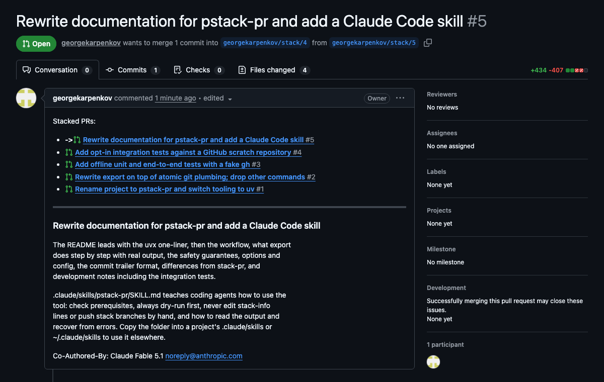

# pstack-pr

`pstack-pr export` turns the commits on your branch into a chain of stacked
GitHub pull requests: one PR per commit, each PR based on the previous one and
the first based on `main`. Reviewers get one small diff per PR; you keep working
on a single linear branch and re-run `export` whenever it changes. It is a
rewrite of [modular/stack-pr](https://github.com/modular/stack-pr) with a single
command and a stricter safety model (see [Safety](#safety)).

## Run it

Nothing to install; [uv](https://docs.astral.sh/uv/) fetches the tool and a
Python for it:

```sh
uvx --from git+https://github.com/georgekarpenkov/stack-pr@v0.2.2 pstack-pr export -n   # preview
uvx --from git+https://github.com/georgekarpenkov/stack-pr@v0.2.2 pstack-pr export      # do it
```

For a persistent `pstack-pr` command:

```sh
uv tool install git+https://github.com/georgekarpenkov/stack-pr@v0.2.2
```

`v0.2.2` is the latest release tag; see [CHANGELOG.md](CHANGELOG.md).

Requirements: `git`, and the GitHub CLI [`gh`](https://cli.github.com/) logged
in (`gh auth login`). Python is handled by uv.



The screenshot shows the stack of pull requests this very rewrite was
submitted with.

## Workflow

```sh
git switch -c feature origin/main   # branch from main
# ...make one commit per reviewable change...
pstack-pr export --dry-run          # look at the plan
pstack-pr export                    # create the PRs
# ...amend, reorder or insert commits (git rebase -i)...
pstack-pr export                    # update the PRs
```

The first line of each commit message becomes the PR title and the rest
becomes the PR description, so write them for the reviewer. Re-running
`export` after any change to the branch updates exactly the PRs whose commit,
position or message changed.

Landing happens through the GitHub UI; there is no `land` command. Merge the
bottom PR (the one based on `main`), then locally:

```sh
git pull --rebase origin main   # or: git fetch && git rebase origin/main
pstack-pr export
```

The rebase drops the merged commit because its change is already in `main`
(if it survives, drop it in `git rebase -i`), and the next `export` retargets
the new bottom PR to `main` and updates the rest. Repeat for each PR.

## What export does

Planning is read-only apart from a fetch of the target branch alone (an
explicit refspec, so the server sends just that ref and an empty pack when
nothing changed). The stack branches are looked up with one `git ls-remote
--heads` for exactly the names in the commits, plus the name template's
pattern when a new branch must be allocated. Other remote branches are never
fetched, so the cost does not grow with the number of branches or pull
requests in the repository. The stack is the linear range
from the merge base of `HEAD` and `origin/main` to `HEAD`; each commit is
mapped to a branch (from its `stack-info:` trailer, or a remote branch whose
tip is that exact commit, or a fresh `<user>/stack/N`) and all existing PRs
are looked up in a single GraphQL request. `--dry-run` prints the resulting plan and stops; `-v` prints it and
then shows each step as it runs; by default only the result is printed. The
steps run in this order:

1. Retarget PRs that GitHub would otherwise auto-close (only when commits were
   reordered): their base is pointed at `main` and they are marked draft
   while the branches are pushed.
2. Push the original commits of entries that need a new PR; GitHub needs the
   head branch to exist before a PR can be created.
3. Create the missing PRs. Now every commit has a PR URL.
4. Create rewritten commit objects whose messages carry the `stack-info:`
   trailer (`git commit-tree`; trees, authors, committers and dates are
   preserved). Commits above the stack, if any, are re-parented.
5. Move the local branch to the rewritten commits in one atomic,
   compare-and-swap `git update-ref` transaction. This is the only local write.
6. Push the rewritten commits to all stack branches
   (`--atomic --force-with-lease`).
7. Bring titles, descriptions (with the cross-links list) and base branches of
   the PRs up to date, and undo the temporary draft state from step 1.

A first export of three commits looks like this with `--dry-run`:

```
Contacting origin...
Stack of 3 commits on feature (base: origin/main @ 1a2b3c4d)
   3  a082cd30  new PR  alice/stack/3  Add c
   2  5e6f7a8b  new PR  alice/stack/2  Add b
   1  9c0d1e2f  new PR  alice/stack/1  Add a

Plan:
   1. push to origin: 9c0d1e2f -> alice/stack/1 (new branch), 5e6f7a8b -> alice/stack/2 (new branch), a082cd30 -> alice/stack/3 (new branch)
   2. create PR for 9c0d1e2f: alice/stack/1 -> main
   3. create PR for 5e6f7a8b: alice/stack/2 -> alice/stack/1
   4. create PR for a082cd30: alice/stack/3 -> alice/stack/2
   5. rewrite 3 commit messages to embed stack-info (git commit-tree; file contents, authors and dates are unchanged)
   6. move feature from a082cd30 to the rewritten tip (git update-ref, only if it is still at a082cd30)
   7. push the stack to origin (--atomic --force-with-lease): alice/stack/1, alice/stack/2, alice/stack/3
   8. update the new PR for 9c0d1e2f: body (cross-links)
   9. update the new PR for 5e6f7a8b: body (cross-links)
  10. update the new PR for a082cd30: body (cross-links)

Dry run: nothing was changed.
```

Without `--dry-run` the plan is executed and only the result is printed: one
line per PR marked `new`, `updated` or `unchanged`, and the branches pushed.

```
Exported 3 pull requests (3 new):
   3  #3  new        https://github.com/octo/widgets/pull/3  Add c
   2  #2  new        https://github.com/octo/widgets/pull/2  Add b
   1  #1  new        https://github.com/octo/widgets/pull/1  Add a
Branches pushed: alice/stack/1 (new), alice/stack/2 (new), alice/stack/3 (new)
```

After amending the top commit and exporting again:

```
Exported 3 pull requests (1 updated, 2 unchanged):
   3  #3  updated    https://github.com/octo/widgets/pull/3  Add c
   2  #2  unchanged  https://github.com/octo/widgets/pull/2  Add b
   1  #1  unchanged  https://github.com/octo/widgets/pull/1  Add a
Branches pushed: alice/stack/3 (updated)
```

Running it again right away prints `Up to date: 3 pull requests, nothing to
push.` followed by the same list. Pass `-v` to also see the plan and each step
as it runs, `-vv` for every `git` and `gh` command.

## Safety

- The working tree and index are never touched: no checkout, rebase, stash or
  amend. Uncommitted changes are fine.
- Commit messages are rewritten by creating new commit objects with
  `git commit-tree`. Trees, authors, committers and dates are unchanged.
- The local branch is moved once, with a single compare-and-swap
  `git update-ref --stdin` transaction that fails if the branch moved
  meanwhile. Nothing else local is written.
- Pushes are `--atomic --force-with-lease`, so either all stack branches
  move or none, and never over a commit the tool has not seen.
- Ctrl-C at any point is safe. Before step 5 the local repository is
  untouched; re-running adopts the branches already pushed (matched by commit
  sha) instead of allocating new ones, so no duplicate PRs are created. After
  step 5 the commit messages already reference the right PRs and re-running
  finishes the remote side. The one thing to avoid is amending commits between
  an interrupted run and the re-run: the sha match then fails and the re-run
  opens new PRs while the ones from the interrupted run stay open.
- The stack must be reachable from a local branch (or from a detached `HEAD`).
  With `-H <sha>`, `-H <tag>` or `-H origin/x` and no local branch containing
  the commits, export refuses to run, because nothing local could record the
  `stack-info:` trailers and every re-run would create new PRs.
- A re-export with nothing to do makes no write calls to git or GitHub. PRs are
  only edited when their title, description or base actually differs. Commits
  that did not change cost nothing: no fetch, no push, no rewrite, no PR edit;
  the PR lookups for the whole stack are one request.
- When commits are reordered, a PR whose base branch now sits above it would
  be auto-closed by GitHub the moment the branches are pushed. Such PRs are
  temporarily retargeted to `main` and marked draft, then restored. While a PR
  is in that state its description ends with an HTML comment
  (`<!-- pstack-pr: temporarily a draft ... -->`) so that a re-run after an
  interruption knows to mark it ready again. On plans without draft PRs the
  draft step is skipped with a warning.

## Options

| Flag | Default | Meaning |
| --- | --- | --- |
| `-n`, `--dry-run` | | print what would be done and exit without changing anything |
| `-R`, `--remote REMOTE` | `origin` | remote name |
| `-T`, `--target TARGET` | `main` | branch on the remote the stack is based on |
| `-B`, `--base BASE` | merge base of `HEAD` and `REMOTE/TARGET` | bottom of the stack, exclusive |
| `-H`, `--head HEAD` | `HEAD` | top of the stack, inclusive |
| `-d`, `--draft` | off | create new pull requests as drafts |
| `--reviewer REVIEWER` | | comma-separated GitHub handles to request reviews from on new PRs |
| `--keep-body` | off | keep existing PR descriptions and only refresh the cross-links |
| `--branch-name-template T` | `$USERNAME/stack` | template for stack branch names |
| `-v`, `--verbose` | off | show the plan and progress while it runs; `-vv` also shows every git and gh command |

Defaults can be set in `.pstack-pr.cfg` at the repository root (or the file
named by the `PSTACK_PR_CONFIG` environment variable). Command line flags win.

```ini
[repo]
remote = origin
target = main
reviewer = alice,bob
branch_name_template = $USERNAME/stack

[common]
draft = false
keep_body = false
verbose = false
```

The branch name template expands `$USERNAME` (your GitHub login), `$BRANCH`
(the checked-out local branch) and `$ID` (a number). If `$ID` is missing,
`/$ID` is appended. New IDs are allocated after the highest one already on the
remote, so `$USERNAME/$BRANCH` yields `alice/feature/1`, `alice/feature/2`, ...

## Commit metadata

`export` links a commit to its PR by appending one trailer paragraph to the
commit message:

```
Add b

Explain the change here; this becomes the PR description.

stack-info: PR: https://github.com/octo/widgets/pull/2, branch: alice/stack/2
```

The format is exactly `stack-info: PR: <url>, branch: <name>`. Never edit it
by hand: the URL and branch are checked against GitHub on every run and a
mismatch is an error. The trailer is stripped when the PR description is
generated, and the format is the same as stack-pr's, so stacks created with it
are picked up unchanged.

To detach a commit from its PR, delete the `stack-info:` line (for example
with `git commit --amend` or a `reword` in `git rebase -i`). The next `export`
treats the commit as new: it gets a fresh branch and a new PR, and the commits
above it are rewritten to sit on top of it. The old PR is left alone; close it
on GitHub if you no longer want it.

## Differences from stack-pr

| stack-pr | pstack-pr |
| --- | --- |
| `submit` / `export`, `view`, `land`, `abandon`, `config` | `export` only |
| `view` | `export --dry-run` |
| `land` | removed; merge on GitHub, then `git pull --rebase origin main` and `export` |
| `abandon` | removed; delete the `stack-info:` lines and close the PRs on GitHub |
| `-s`, `--stash` | unnecessary; the working tree is never touched |
| `--draft-bitmask` | removed; `--draft` applies to all new PRs |
| `config` command | removed; edit `.pstack-pr.cfg` |
| `.stack-pr.cfg`, `STACKPR_CONFIG` | `.pstack-pr.cfg`, `PSTACK_PR_CONFIG` |

## Development

```sh
uv sync                 # create .venv with dev dependencies
uv run pytest           # offline tests (files run in parallel; -n 0 for serial)
uv run ruff check .
uv run ruff format .
uv run mypy
```

The offline tests never talk to the network. A bare repository stands in for
GitHub and a fake `gh` ([tests/fake_gh.py](tests/fake_gh.py)) on `PATH` keeps
pull requests in a JSON file, validates `pr create` against the bare
repository's branches, and records every call so tests can assert exactly
which writes happened. A `post-receive` hook in the bare repository closes any
open PR whose head branch has no commits beyond its base, which is what GitHub
does after a push. See [tests/conftest.py](tests/conftest.py) for the
fixtures.

Integration tests talk to a real GitHub repository and are skipped by default.
Create your own private scratch repository with a `main` branch, make sure
`gh auth status` is green, then:

```sh
PSTACK_PR_TEST_REPO=you/scratch uv run pytest --integration
```

The default scratch repository is `georgekarpenkov/pstack-pr-test`.

## Using it from Claude Code (or other agents)

[.claude/skills/pstack-pr/SKILL.md](.claude/skills/pstack-pr/SKILL.md) tells
an agent how to use the tool safely: check prerequisites, always dry-run
first, never edit `stack-info:` lines or push stack branches by hand. Copy the
`.claude/skills/pstack-pr` folder into your project's `.claude/skills/`, or
into `~/.claude/skills/` to have it in every project.

## License

Apache License 2.0 with LLVM Exceptions; see [LICENSE](LICENSE).
